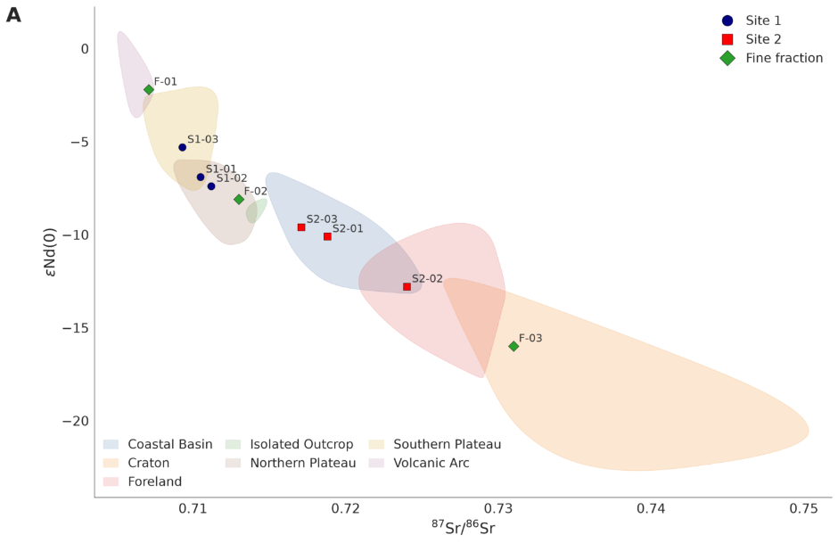
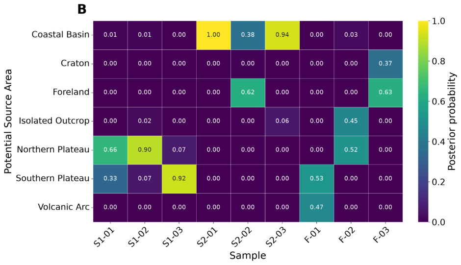

# Bayesian Model for PSA

An open, browser-based tool to estimate the **provenance of sediment / dust / cryoconite samples** from a set of
**Potential Source Areas (PSAs)** using a Bayesian classifier on **⁸⁷Sr/⁸⁶Sr** and **¹⁴³Nd/¹⁴⁴Nd (εNd)** isotope data.

Users upload their own data (CSV or TXT), map the columns, choose which PSAs and which samples enter the model,
and get two publication-ready figures:

| A · PSA envelopes and samples | B · Posterior probability heatmap |
|---|---|
|  |  |

*(Figures generated from the synthetic example data in `examples/`.)*

---

## Features

- Upload **CSV / TXT / TSV** files; delimiter (`,` `;` tab `|` whitespace) is detected automatically.
- Handles **decimal commas** (`0,7123`), thousand separators, Unicode minus signs and missing tokens (`NA`, `-`, …).
- All file columns are listed so you can **map** them: region, ⁸⁷Sr/⁸⁶Sr (plus an optional *preferred*, e.g.
  grain-size-corrected, value), ¹⁴³Nd/¹⁴⁴Nd and/or εNd(0), sample ID, uncertainties, sample group.
- PSA table with checkboxes to **include/exclude each PSA from the model** and, independently, **from the diagram**,
  plus editable prior weights and colours.
- Sample table with checkboxes (and a group filter) to **choose which samples are analysed**.
- Robust (MCD) covariance per PSA, propagation of each sample's analytical uncertainty (1σ or 2σ), uniform or custom priors.
- Outputs: **Figure A** (⁸⁷Sr/⁸⁶Sr vs εNd(0) or ¹⁴³Nd/¹⁴⁴Nd with smoothed PSA envelopes) and **Figure B** (heatmap),
  each downloadable as **PNG (600 dpi), PDF and SVG**; posterior tables, diagnostics and PSA statistics as **CSV**.
- Diagnostics flag samples lying outside the 95 % ellipse of *every* selected PSA.

## The model

For every selected PSA *k* a bivariate normal distribution is fitted to its (⁸⁷Sr/⁸⁶Sr, ¹⁴³Nd/¹⁴⁴Nd) data with the
Minimum Covariance Determinant estimator (PSAs with fewer than 4 analyses use a diagonal covariance).
For a sample **x** with analytical covariance **S** = diag(σ²<sub>Sr</sub>, σ²<sub>Nd</sub>):

```
p(x | k) = N(x ; μ_k , Σ_k + S)

P(k | x) = π_k · p(x | k) / Σ_j π_j · p(x | j)
```

π<sub>k</sub> are the prior probabilities (uniform by default). The posteriors are **relative** — they sum to 1 over the
PSAs you include. A sample far from every PSA can still receive a high probability for the "least unlikely" one;
use the *Diagnostics* table (`min_mahalanobis_distance`, `outside_all_95pct_ellipses`) to spot those cases.

εNd(0) = (¹⁴³Nd/¹⁴⁴Nd<sub>sample</sub> / CHUR − 1) × 10⁴, with CHUR = 0.512638 by default (editable).

## Input format

**PSA (reference) file** – one row per analysis:

| Region | 87Sr/86Sr | 143Nd/144Nd | eNd(0) |
|---|---|---|---|
| Volcanic Arc | 0.705252 | 0.512583 | -1.07 |

**Samples file**:

| Sample | Group | 87Sr/86Sr | 87Sr/86Sr_err (2s) | 143Nd/144Nd | 143Nd/144Nd_err (2s) |
|---|---|---|---|---|---|
| S1-01 | Site 1 | 0,710500 | 0,000012 | 0,512284 | 0,000010 |

Column names do not need to match — you pick them in the app. Only one of ¹⁴³Nd/¹⁴⁴Nd or εNd(0) is required;
the other is computed. Uncertainties and group are optional. Example files: [`examples/`](examples/)
(synthetic data, regenerated with `python examples/make_examples.py`).

## Run locally

```bash
git clone https://github.com/rafaeldosreis/Bayesian-Model-for-PSA.git
cd Bayesian-Model-for-PSA
python -m venv .venv && source .venv/bin/activate   # Windows: .venv\Scripts\activate
pip install -r requirements.txt
streamlit run app.py
```

The app opens at <http://localhost:8501>. Run the tests with `pip install pytest && pytest`.

The core logic is also usable from Python without the web interface:

```python
from psa import read_table, fit_sources, compute_posteriors
from psa.plotting import plot_region_diagram, plot_posterior_heatmap
```

## Publish it online

### Option 1 – Streamlit Community Cloud (free, recommended)

1. Push this repository to GitHub (it must be public for the free tier, or grant Streamlit access to private repos).
2. Go to <https://share.streamlit.io> and sign in with your GitHub account.
3. Click **Create app → Deploy a public app from GitHub**.
4. Choose repository `rafaeldosreis/Bayesian-Model-for-PSA`, branch `main`, main file path `app.py`.
5. (Optional) choose a custom sub-domain, e.g. `bayesian-psa.streamlit.app`, and Python 3.11 under *Advanced settings*.
6. Click **Deploy**. Every new push to the branch redeploys the app automatically.

### Option 2 – Hugging Face Spaces (free)

1. Create a new Space at <https://huggingface.co/new-space>, SDK **Docker** (or **Streamlit** if offered).
2. Push this repository to the Space (`git remote add space https://huggingface.co/spaces/<user>/bayesian-psa`
   then `git push space main`). The included `Dockerfile` is used; set `app_port: 8501` in the Space's README
   front-matter when using Docker.

### Option 3 – Your own server / institutional VM (Docker)

```bash
docker build -t bayesian-psa .
docker run -d -p 8501:8501 bayesian-psa
```

Put it behind a reverse proxy (nginx/Caddy) with HTTPS for a public URL.

### Linking it from an existing website

Once deployed, add a link or embed the app in any web page (lab website, Google Sites, WordPress, …):

```html
<iframe src="https://bayesian-psa.streamlit.app/?embed=true"
        width="100%" height="1100" style="border:none;"></iframe>
```

## Project structure

```
app.py                 Streamlit web interface
ui_style.py            visual style (CSS, header, footer)
psa/io.py              robust CSV/TXT reading and number parsing
psa/model.py           source fitting and Bayesian posteriors
psa/plotting.py        figure A (region diagram) and figure B (heatmap)
examples/              synthetic example data + generator script
tests/                 pytest unit tests
Dockerfile             container for self-hosting
.streamlit/config.toml app theme / upload limits
```

## License

MIT – see [LICENSE](LICENSE).
